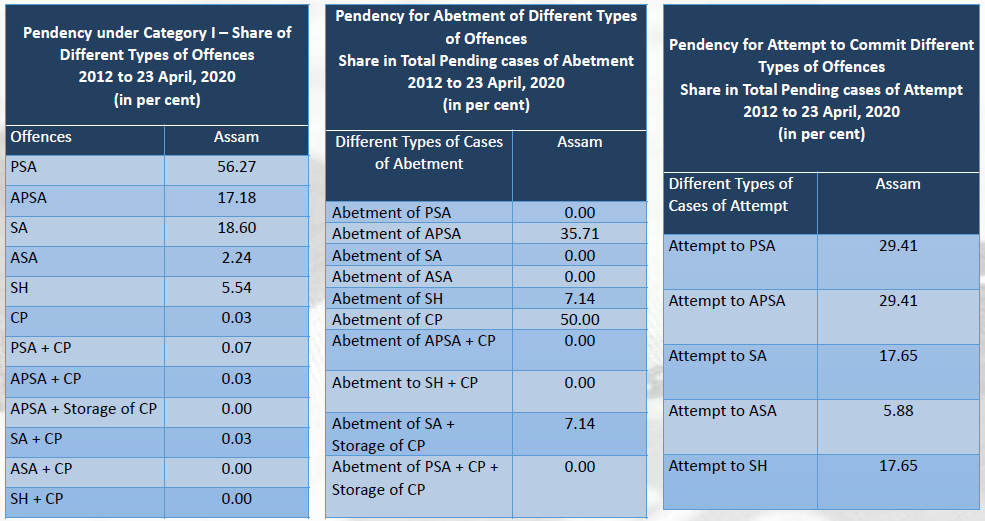
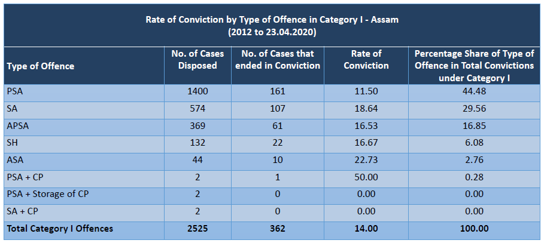
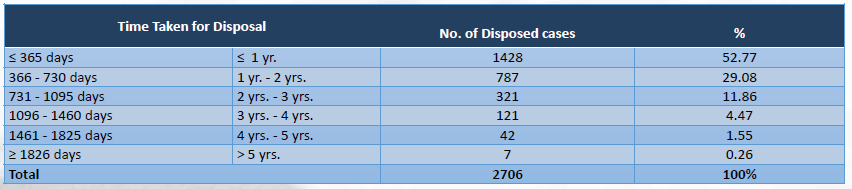
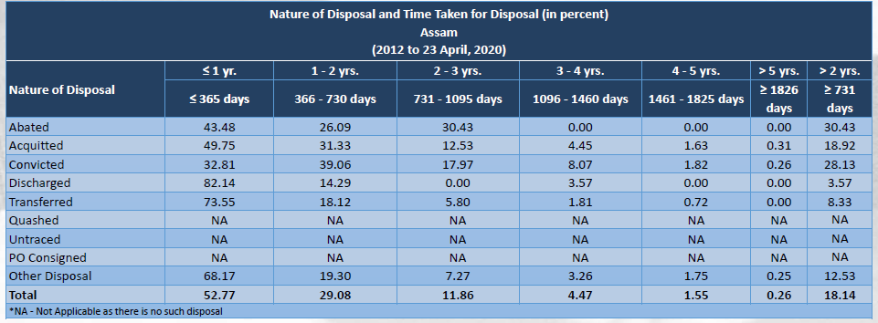
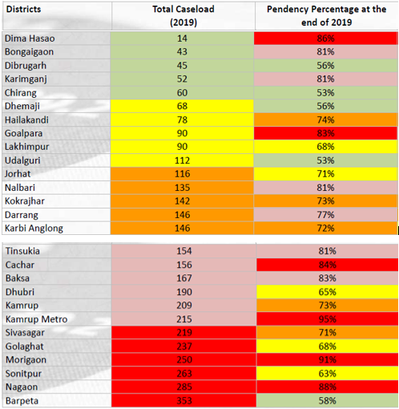

<br /> Last updated: `r format(Sys.time(), '%d %B, %Y')` (See [changelog](https://github.com/apoorv74/OBI-data-explorer/commits/master)).

```{r Report options, include=FALSE}
# Options for building this document
knitr::opts_chunk$set(
  fig.height=5, 
  fig.width=10, 
  fig.align='center',
  message=FALSE,
  warning=FALSE
)
```

### Chart 1 - Total Cases

<iframe title="" aria-label="Map" id="datawrapper-chart-BoETa" src="https://datawrapper.dwcdn.net/BoETa/3/" scrolling="no" frameborder="0" style="width: 0; min-width: 100% !important; border: none;" height="308"></iframe><script type="text/javascript">!function(){"use strict";window.addEventListener("message",(function(e){if(void 0!==e.data["datawrapper-height"]){var t=document.querySelectorAll("iframe");for(var a in e.data["datawrapper-height"])for(var r=0;r<t.length;r++){if(t[r].contentWindow===e.source)t[r].style.height=e.data["datawrapper-height"][a]+"px"}}}))}();
</script>/

---

### Chart 2 - Cases pending

<iframe title="Cases pending in each district" aria-label="Bar Chart" id="datawrapper-chart-0ZMA7" src="https://datawrapper.dwcdn.net/0ZMA7/1/" scrolling="no" frameborder="0" style="width: 0; min-width: 100% !important; border: none;" height="741"></iframe><script type="text/javascript">!function(){"use strict";window.addEventListener("message",(function(e){if(void 0!==e.data["datawrapper-height"]){var t=document.querySelectorAll("iframe");for(var a in e.data["datawrapper-height"])for(var r=0;r<t.length;r++){if(t[r].contentWindow===e.source)t[r].style.height=e.data["datawrapper-height"][a]+"px"}}}))}();
</script>

---

### Table 1 - Cases pending under each category



---

### Table 2 - Conviction rates by type of offence



---

### Table 3 - Time taken for disposal



---

### Table 4 - Disposal time as per the nature of disposal



---

### Table 5 - District Report Card



---

### Insights

1. Assam witnessed an increase in disposal rate from 9% in 2014 to 20% in 2015, it again saw a decline from to 16% in 2016.

2. Of the top 6 districts with the highest court caseload in Assam, **Nagaon** and **Morigaon** require utmost attention since their performance is poor on all parameters studied - the caseload is high (266 & 257 Cases respectively) and so is pendency due to poor disposal.

3. **Cachar** and **Kamrup Metro** have very high pendency and low disposal, particularly Kamrup Metro with a disposal rate as low as 5%.

4. **Dima Hasao** needs attention as reasons for high pendency and low disposal require a thorough assessment, given that the district has the lowest court caseload in the entire State.

5. Districts that seem to be doing better than others on all three counts, viz. court caseload, pendency and disposal are Dibrugarh, Chirang, Dhemaji, Lakhimpur and Udalguri.

