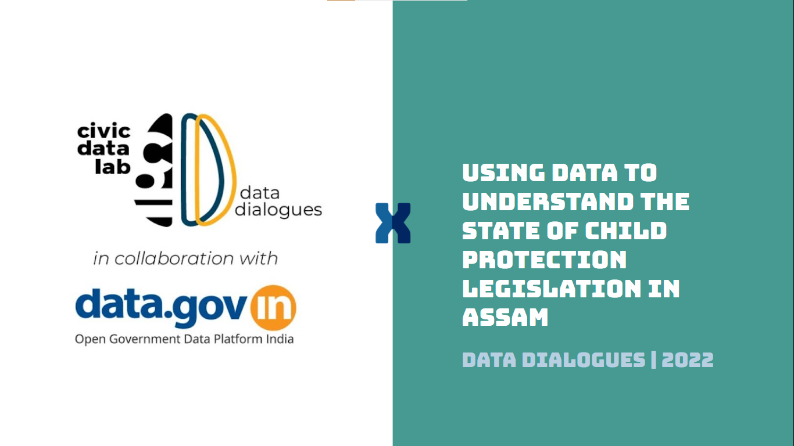

```{r xaringan-logo, echo=FALSE}
xaringanExtra::use_logo("https://drive.google.com/uc?id=1WbdosVvi6SBjYtEF6kHj-f0wotdHMRgw",link_url = "https://civicdatalab.in",exclude_class = NULL)
```

```{r xaringan-fit-screen, echo=FALSE}
xaringanExtra::use_fit_screen()
```

```{r xaringan-tile-view, echo=FALSE}
xaringanExtra::use_tile_view()
```

```{r xaringan-themer, include=FALSE, warning=FALSE}
library(xaringanthemer)

style_mono_accent(base_color = "#479A91",colors = c(
  red = "#f34213",
  purple = "#3e2f5b",
  orange = "#ff8811",
  green = "#136f63",
  white = "#FFFFFF"
))
# ,
#   text_font_google   = google_font("Oxygen", "300", "300i")
```



---
class: center, middle

# Part 1 - Tracking laws using data

---

# Why Track ?

Because it might lead to:

1. Institutional Accountability

--

2. Identification of gaps and challenges in law enforcement practices by various departments

--

3. Data driven, evidence based amendments to laws and policies

--

4. Better impact assessment of laws

--

5. Efficient courts

--

6. **Timely Justice**

---

# Using data to track child-protection laws

1. The [Crime in India](https://ncrb.gov.in/en/crime-india) reports released by the National Crime Records Bureau are an important resource for researchers

--

2. The datasets are made available to the public via NCRB's website and also through [data.gov.in](https://data.gov.in/)

--

3. The indicators within these datasets are aggregated at a state and district level and are also made available for certain metropolitan cities

--

4. NCRB started computing data for cases registered under the POCSO Act from 2014 onwards

--

5. The latest data available on the NCRB website is from 2020.  

---
class: center, middle

# POCSO related indicators in the NCRB dataset

---

# Indicators - For Persons Arrested

- Persons Arrested
- Persons Chargesheeted
- Persons Convicted
- Persons Discharged
- Persons Acquitted		

---

# Indicators - For Courts

.pull-left[
- Cases Pending Trial from the Previous Year
- Cases Sent for Trial during the year
- Total Cases for Trial
- Cases Abated by Court
- Cases Withdrawn from Prosecution
- Cases Compounded or Compromised
- Cases Disposed off by Plea Bargaining	
- Cases Quashed
- Cases Disposed off without trial
- Cases Stayed or Sent to Record Room
]

.pull-right[
- Cases Convicted Out of Cases from Previous Year	
- Cases Convicted Out of Cases during the Year	
- Cases Discharged	
- Cases Acquitted
- Cases which Trials were Completed 
- Cases Disposed off by Courts
- Cases Pending Trial at End of the Year
- Conviction Rate 
- Pendency Percentage
]

---

# Indicators - For Police

.pull-left[
- Cases Pending Investigation from Previous Year
- Cases Reported during the year
- Cases Reopened for Investigation
- Cases Not Investigated Under 157_1_b CRPC
- Cases Transferred to Other State or Agency
- Cases Withdrawn by the Govt during Investigation	
]

.pull-right[
- ChargeSheets Submitted
- Total Cases Disposed Off by Police 
- Cases Quashed at Investigation Stage	
- Cases Stayed at Investigation Stage	
- Cases Pending Investigation at end of the year
- Chargesheeting Rate 
- Pendency Percentage
]

---

# Indicators - For Police (Contd.)

- Cases Ended as FR Non Cognizable
- Cases Ended as Final Report False	Cases Ended as Mistake of Fact or of law or Civil Dispute
- Cases True but Insufficient Evidence or Untraced or No Clue	
- Cases Abated during Investigation
- Cases Charge sheeted Out of cases From Prev. Year	
- Cases Charge sheeted Out of Cases during the year	

---

# Is data from NCRB enough to track laws

.pull-left[

.center[**Where it helps**]

1. The only official source of crime statistics in the country
2. To understand larger patterns of crime within a geography
3. Disaggregated data, at the district levels, might be available through the State Crime Records Bureau.
4. Data is available in machine readable formats
5. A few indicators are available for several years. This helps in identifying trends over a period of time.
6. Data is available in Hindi and English. 

]

.pull-right[

.center[**Where it doesn't**]

1. Frequent changes in the methodology for capturing data for certain indicators. This makes it difficult to compare indicators across years.
2. The exact methodology to capture each indicator is not documented.
3. Data is available after a gap of at-least an year and sometime more.
4. Data not available for all states and districts.
5. Disaggregated data, at the police station level, is hard to procure.

]

---

# Other data sources for tracking laws

.center[.bg-green[.white[
_Data maintained by courts is an important resource that can help us track laws_
]
]
]

--

A few important features of data maintained by courts:

--

1. **Granularity** - Data is available for each case

2. **Timeliness** - Data is available on a near real-time basis

3. **Coverage** - Data is available in a standard format across all courts

4. **Ease of access** - Data for any case can be easily accessed through the e-Courts portal

5. **Availability of tools and resources** - Platforms like the [National Judicial Data Grid](https://njdg.ecourts.gov.in/njdgnew/index.php) can be used to explore and analyse data curated by courts

---

# Challenges of accessing data from courts

.bg-red[
.white[.center[
The data from courts is a useful resource but is not as accessible.]]]

1. Accessing or downloading cases in bulk

--

2. Data curation practices differ across courts and hence the data is not standaridsed

--

3. Hard to identify cases registered under a particular act or section because of data standardisation issues

--

4. The dataset, especially orders and judgments, if available, might contain a lot of sensitive information which makes it harder for anyone to share this dataset as a common resource

--

5. Data completeness related issues - A lot of times, data is not available for certain important fields like police station details, reason for adjournments, etc. 

--

6. Information for older cases might be harder to obtain from certain courts. 

---

# Case indicators on e-Courts

.center[.middle[.card[
[](https://github.com/CivicDataLab/DataDialogues-Assam/blob/main/resources/e_courts_vars.png)


[List of indicators](https://justicehub.in/dataset/data4justice-unpacking-judicial-data-to-track-implementation-of-the-pocso-act-in-assam-delhi-haryana/resource/84cdbe15-371c-4951-8079-79fe48df2df2) 
]]]

---
class: center, middle

# How we used data from e-Courts to track POCSO Act in Assam

---

# About the project

- We collaborated with [HAQ - Centre for Child Rights](https://www.haqcrc.org/) to track the implementation of the POCSO Act in Assam, Delhi and Haryana.

--

- The project was part of the grant received via the Data for Justice challenge organised by [Agami](https://agami.in/)

--

- The main source of data for research is cases uploaded on the **e-Courts web portal for district courts**. Cases for eight years starting 2012 to 2020 have been considered.

--

- We were able to create a dataset of **19,783** cases. Out of which, **5,786** (**29%**) cases are from Assam.

--

- In data collected for Assam, **2,706** (46%) cases were disposed and **3,080** were pending during the time of data collection.

--

- Judgments were available in **1,152** (42%) of disposed cases. 

---

# Assam - Factsheet

.center[
.middle[
.card[

[](https://justicehub.in/dataset/data4justice-unpacking-judicial-data-to-track-implementation-of-the-pocso-act-in-assam-delhi-haryana/resource/7d6ac0bf-89b2-4630-81eb-30c97c2b6419)

[View Here](factsheet.html)

]
]
]
---

class: center, middle

# Part 3 - Way Forward. What's next.  

---

# Court data is powerful but limited

1. With limited indicators and unavailability of orders and judgments for cases, it is hard to understand several legal aspects of proceeding, acquittal, conviction, and bail.

--

2. Important indicators like time taken to file a chargesheet are not available in the e-Courts database

--

3. Time taken from cognizance to completion of child's testimony is not captured in the system. 

--

4. Reasons for adjournments are not captured properly.

--

5. No details mentioned around interim or final compensation to the victims. The time it takes for court to grant interim compensation is also not known. 

--

6. Other important indicators around **Shelter and Witness** protection support, **Medical Support**, **Educational support**, **paralegal support**, etc are not captured

---
class: center, middle

# We need more indicators

.bg-purple[.white[
To really understand how each and every POCSO case is dealt with is currently impossible. Data coming from Police and Courts are important components but they don't tell the complete story. 

Without robust data coming in from other systems as well, it will be hard to design initiatives that lead to better implementation of these laws.

]
]

---

# Taking this work ahead

1. Discussion with stakeholders on how this information can be used by them for advocacy and other purposes. 

--

2. Sharing our recommendations with the e-Committee of the Supreme Court of India on how can the e-Courts platform be updated for enhancing information capture and retrieval

--

3. Collaborating with researchers to identify steps that can be taken by courts to share information related to POCSO cases without compromising anyone's identity

--

4. Finding ways to collaborate with the Child Protection Commissions, Legal Aid authorities, etc on enhancing their internal data capacity to improve the state of data which is captured by their internal systems.


---

# All Resources

.pull-left[
.center[.card[


[https://bit.ly/jh-pocso](https://bit.ly/jh-pocso)
]
]
]

.pull-right[
<br>
[Research Report](https://justicehub.in/dataset/data4justice-unpacking-judicial-data-to-track-implementation-of-the-pocso-act-in-assam-delhi-haryana/resource/9377bdfc-b723-4617-a74c-9ae508ebe3f3) 
<hr>
[Datasets](https://justicehub.in/dataset/data4justice-unpacking-judicial-data-to-track-implementation-of-the-pocso-act-in-assam-delhi-haryana/resource/f667d254-0f39-4bd3-8f6a-e3043d0991f1)
<hr>
[Data Codebook](https://justicehub.in/dataset/data4justice-unpacking-judicial-data-to-track-implementation-of-the-pocso-act-in-assam-delhi-haryana/resource/84cdbe15-371c-4951-8079-79fe48df2df2) 
<hr>
[Assam - Factsheet](https://justicehub.in/dataset/data4justice-unpacking-judicial-data-to-track-implementation-of-the-pocso-act-in-assam-delhi-haryana/resource/7d6ac0bf-89b2-4630-81eb-30c97c2b6419)
]

---

# We need your support and feedback

1. How can data help in understanding the gaps and challenges faced by stakeholders who play an important role in the POCSO ecosystem ? 

2. How we can support other stakeholders for better tracking and monitoring of child protection legislation in Assam?

---

class: center, middle

# Thank you!

Access the slides at - [https://bit.ly/data-dialogues-pocso](https://bit.ly/data-dialogues-pocso)


